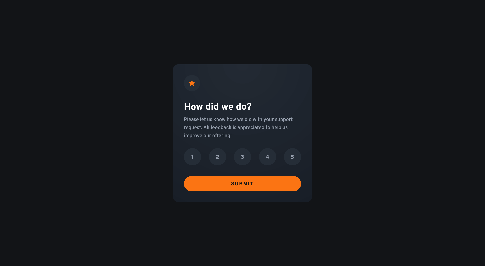
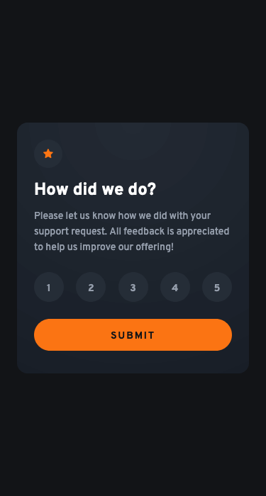

# Frontend Mentor - Interactive rating component solution

This is a solution to the [Interactive rating component challenge on Frontend Mentor](https://www.frontendmentor.io/challenges/interactive-rating-component-koxpeBUmI). Frontend Mentor challenges help you improve your coding skills by building realistic projects.

## Table of contents

- [Overview](#overview)
  - [The challenge](#the-challenge)
  - [Screenshot](#screenshot)
  - [Links](#links)
- [My process](#my-process)
  - [Built with](#built-with)
  - [What I learned](#what-i-learned)
  - [Continued development](#continued-development)
  - [Useful resources](#useful-resources)
- [Author](#author)

## Overview

### The challenge

Users should be able to:

- View the optimal layout for the app depending on their device's screen size
- See hover states for all interactive elements on the page
- Select and submit a number rating
- See the "Thank you" card state after submitting a rating

### Screenshot

### Links

- Solution URL: [https://github.com/srijanss/interactive-rating-component](https://github.com/srijanss/interactive-rating-component)
- Live Site URL: [https://srijanss.github.io/interactive-rating-component/](https://srijanss.github.io/interactive-rating-component/)

## My process

### Built with

- Semantic HTML5 markup
- CSS custom properties
- Flexbox
- Mobile-first workflow
- [Vite](https://vitejs.dev/) - Lightweight frontend tooling
- [PostCSS](https://postcss.org/) - Tool to transform CSS using plugins

### What I learned

- I tried to make this app with accessibility in mind.
- I learned about the importannce of alt attribute, figcaption element, lengend element etc. and how it makes the web app accessible to all users who uses different technology to access the web.
- I used web components to build both the form and thank you card. I find it easy to separate the required HTML, CSS and JS for each component.
- And I used history API to share the state between two cards. Also used history API to show form card on back button press.

### Continued development

As accessibility is ongoing process, I would try to improve the current solution.

### Useful resources

- [Web components - Custom State Set](https://developer.mozilla.org/en-US/docs/Web/API/CustomStateSet#browser_compatibility) - Very helpful resource about CustomStateSet in web components.
- [History API](https://developer.mozilla.org/en-US/docs/Web/API/History) - Very helpful to understand how history stack works. And how to maintain persistent data using history state.

**Note: Delete this note and replace the list above with resources that helped you during the challenge. These could come in handy for anyone viewing your solution or for yourself when you look back on this project in the future.**

## Author

- Website - [Srijan Manandhar](https://github.com/srijanss)
- Frontend Mentor - [@srijanss](https://www.frontendmentor.io/profile/srijanss)
